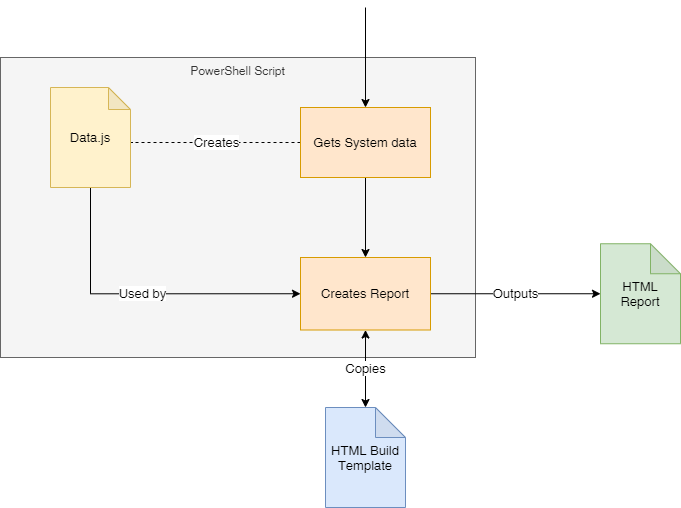

# Generic System Report
A PowerShell paired with a HTML react template. PowerShell gathers system information, creates a data.js file that is passed into a built React project, this data.js is then used by the React webpage in order to generate a report that can be passed and shared around.

A lot of data can be present in this report, therefore functions to filter on the data are also included.

The project used React.js, datatables and Materlise for styling.

## Diagram of Flow
